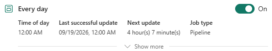
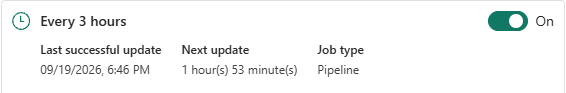
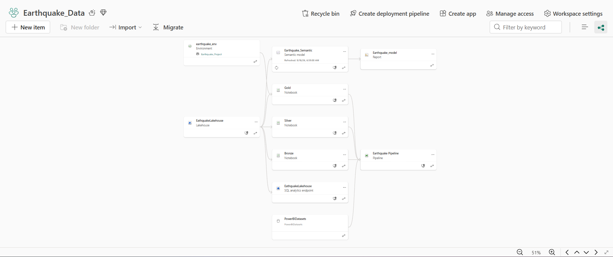
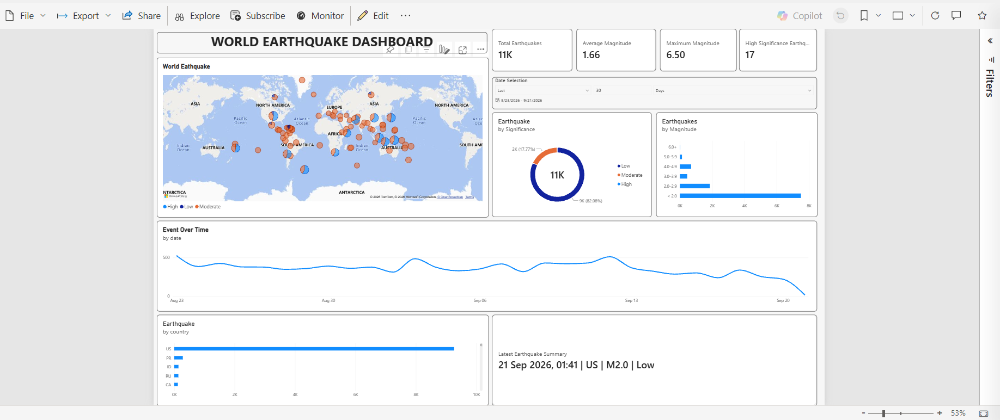

# **Earthquake Event Data Engineering Pipeline · Microsoft Fabric**
An end-to-end data engineering pipeline built on Microsoft Fabric that collects real earthquake data from the USGS API, cleans and transforms it, and serves it to a Power BI dashboard, refreshed automatically every day and every 3 hours.

# **Overview**
The data is collected and processed through Microsoft Fabric, where it moves through a Bronze, Silver, Gold architecture. The processed data is then connected to a power BI semantic model and dashboard for analysis and reporting.

The project also includes a small geospatial component, using the earthquake coordinates to support location-based enrichment such as country identification.

**Stack**: Microsoft Fabric · PySpark · Delta Lake · USGS API · reverse geocoder

## How the Data Flows
Every earthquake detected worldwide is published by the USGS through their public API as a GeoJSON response, containing coordinates, magnitude, significance score, and timestamp

The Bronze notebook calls the API and lands the raw response into the Lakehouse as a date-partitioned JSON file. No transformations, raw data preserved as-is.

The Silver Notebook reads that JSON, flattens the nested GeoJSON structured into a relational schema, extracts longitude, latitude, and depth from the geometry coordinates, and converts unix millisecond timestamp into readable Spark Timestamp values. The cleaned data is upserted into the silver_events Delta table.

The Gold notebook enriches the silver data by deriving a significance class (Low/Moderate/High) from the USGS sig score, and reverse geocoding each event's coordinates to a country code. The enriched data is upserted into gold_events via Delta Lake Merge.

Once Gold completes, the pipeline triggers a Power BI semantic model refresh in Direct Lake mode, the dashboard reflects the latest data automatically, no manual step needed.

The pipeline runs on a dual schedule, daily at midgnight for completeness, and every 3 hours to capture new and revised events within the current day.

# **Architecture**

## Medallion Layers

### Bronze-Raw Ingestion
### Notebook: [Bronze](notebooks/Bronze.ipynb)

Calls the USGS Public API and saves the raw GeoJSON response as a date-partitioned JSON file in the Lakehouse, no transformations, raw data preserved exactly as received.

##

### Silver-Clean & Flatten
### Notebook: [Silver](notebooks/Silver.ipynb)

Reads the Bronze JSON and flattens the nested GeoJSON structure into a clean table/schema.

The transformation extracts information such as: 

* earthquake_id
* longitude
* latitude
* elevation
* title
* place_description
* sig
* mag
* magType
* time
* updated

The unix timestamps provided by the API are also converted into timestamp values, the cleaned data is stored in the Delta Table. The silver layer provides a cleaner and more consistent dataset for downstream processing.

##

### Gold-Enrich & Serve

### Notebook: [Gold](notebooks/Gold.ipynb)

Adds two enrichment columns on top of silver and upserts into **gold_events**. The gold layer prepares the data for analysis and reporting. The Silver data is filtered according to the pipeline date range and additional information is added.

Two main enrichments are performed.

### Significance Classification (sig_class)
* The USGS sig value is converted into three simple categories to make the data easier to interpret and use in reporting:

* Low - sig < 100
* Moderate - sig 100 =< sig < 500
* High - sig >= 500

This provides a simplified representation of the USGS significance score for analysis and visualization in Power BI.

### Reverse Geocoding (country_code)
The earthquake event's latitude and longitude are used to determine its corresponding country.

The coordinates are processed using reverse geocoding, and the resulting country code is added to the Gold Layer. This makes the earthquake data easier to analyze and visualize geographically.

##

## Pipeline Orchestration
The Data Factory pipeline orchestrates the entire data workflow, from retrieving earthquake data from the USGS API to preparing the final dataset for Power BI. The pipeline processes the data through the Bronze, Silver, and Gold layers, applies incremental *incremental upserts* using Delta Lake **MERGE**, and refreshes the semantic model once processing is complete.

The pipeline is automated using **Microsoft Fabric Data Factory** and uses data variable to control the processing window. The pipeline uses a date-iterator loop, processing one day at a time across the date window, with Wait activities between each notebook to allow Spark compute to release its session before the next one starts.

### Dual Schedule
* The daily run handles completeness, the intraday run keeps the dashboard current with the events that happened earlier today.

### Data Management Stategy
The pipeline uses Delta Lake **Merge** for incremental upsert processing. Existing earthquake records are updated in place, which is conceptually similar to SCD (Slowly Changing Dimension) Type 1 behavior, although the Gold table is an event table rather than a traditional dimension.

### Gold Upsert
* The enriched records are then upserted into the **gold_events** Delta table using *Delta Lake* MERGE.
* Existing records matching the **"earthquake_id"** are updated, while new earthquake events are inserted. This allows the GOld layer to remain cuurent as the USGS data is updated.

## Workspace Lineage

The lineage view below shows the full dependency graph across all Fabric items, from environment and lakehouse through to the Power BI report.

## Power BI Report & semantic Model
The **"gold_events"** Delta table is connected to the Earthquake_Semantic model in Direct Lake mode, which powers the Earthquake_model Power BI report. The report is automatically refreshed at the end of every pipeline run.

Direct Lake is a Microsoft Fabric feature that allows PBI to read directly from the Delta table in the Lakehouse without copying or importing the data. This means the moment the pipeline finishes and the semantic model refreshes, the dashboard immediately reflects the latest earthquake data with no manual steps needed.

### World Earthquake Dashboard
The report is built on top of the gold_events table and uses the enriched columns produced by the Gold Notebook (*sig_class*, *country_code*, *mag*. and *time*) to power all the visuals.

* The world map plots every earthquake as a bubble on a global map using the latitude and longitude coordinates. Each bubble is coloured by sig_class, so at a glance you can see where Low, Moderate, and High significance events are clustered across the globe.
* The KPI cards at the top give an instant summary of the current date window, total earthquake count, average magnitude, maximum magnitude, and the number of high significance events.
* The donut chart breaks down the total count by sig_class, showing the proportion of Low, Moderate, and High events. Most earthquakes globally fall into the Low category, which the donut reflects clearly.
* The magnitude bar chart groups events into magnitude bands, showing how many earthquakes fell in each range. This makes it easy to see that smaller magnitude events (below 2.0) dominate the dataset.
* The Event Over Time line charts shows the daily volume of earthquakes across the selected date window, useful for spotting spikes or quiet periods in global seismic activity.
* The country bar chart ranks countries by total earthquake count using the country code column produced by the Gold reverse geocoding step.
* The latest earthquake summary card shows the most recent event in the dataset. date, country, magnitude, and significance class - giving users a quick snapshot of what recently happened.
* The report includes a date slicer where users can type in any number of days, all visuals update simultaneously based on the selected window.

