# Setup Guide
This guide walks through how to recreate the full Earthquake Event Data Engineering Pipeline form scratch on Microsoft Fabric.

## Prerequisites
You need one of the following to access Microsoft Fabric:
* **Microsoft Azure subscription** - with Fabric capacity enabled.
* **Microsoft Fabric Trial** - free 60 days trial via app.fabric.microsoft.com

NOTE: To activate a Fabric trial you need a Microsoft account with an Azure Active Directory (Azure AD) tenant. if you dont have one, create a free Azure account first, then sign in to fabric with the same account.

### Step 1 Create a Workspace
1. Go to Fabric app[app.fabric.microsoft.com]
2. On the left sidebar click Workspace -> New Workspace
3. Name your workspace.
4. Click Apply.

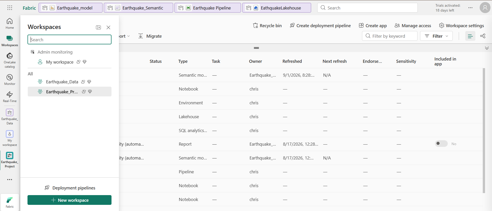

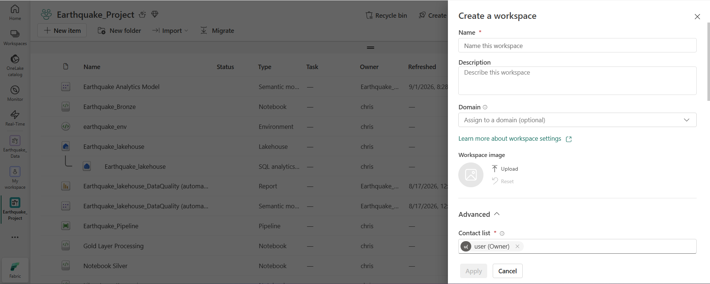

### Step 2 Create a Lakehouse
1. Inside the Earthquake Workspace, click New item
2. Select Lakehouse.
3. Name your Lakehouse and create Lakehouse

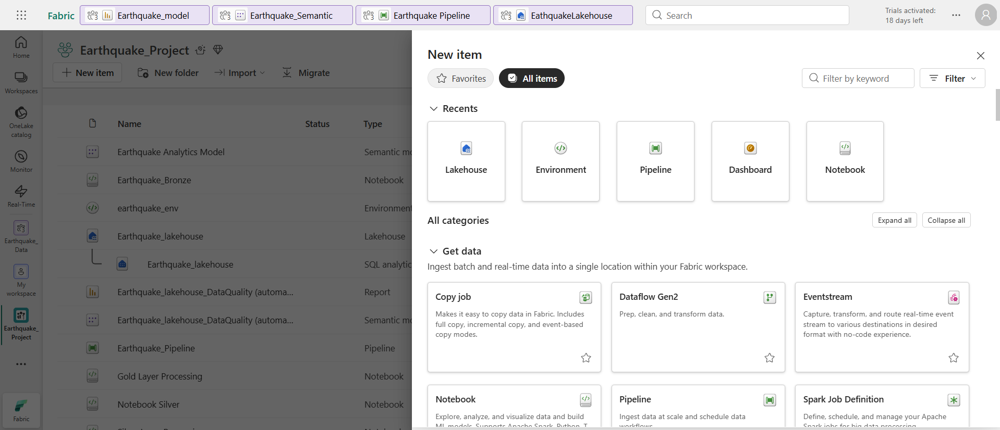

The Lakehouse will automatically provision:
* A **Files** Zone - where Bronze JSON files are stored.
* Delta Tables - where Silver and Gold data lives.
* A **SQL Analytics Endpoint** - auto generated, no setup needed.

### Step 3 Create a custom environment
The Gold notebook requires the reverse_geocoder library which is not available in the default fabric Spark environment.

1. Inside the workspace environment click New Item -> Environemnt
2. Name it and click create.
3. Go to libraries -> External repositories.
   * Public repository: PyPI
   * Name: Search: 'revers geocoder' and choose the latest version.
4. Click save then Publish

* IMPORTANT: Publishing the environment takes a few minutes. Wait until it shows Published before moving to the next step.

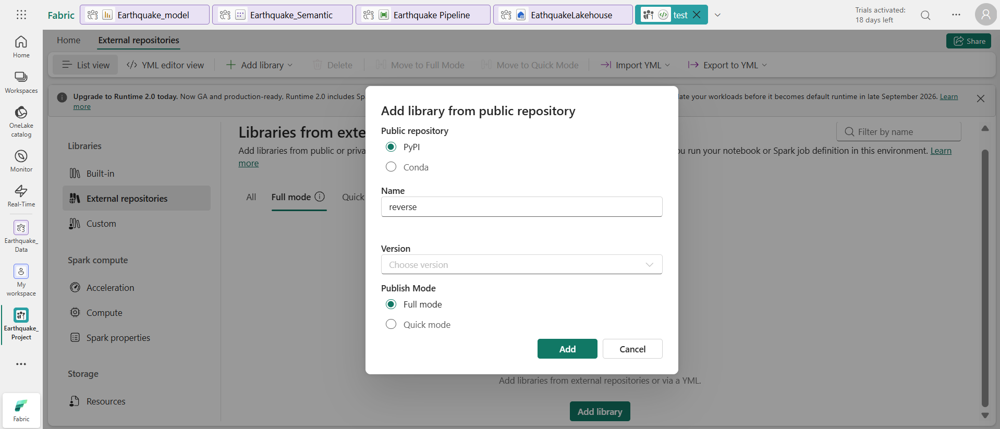

### Step 4 Create the Notebooks

Create four notebook inside the workspace. For each one:

1. Click New Item -> Notebook
2. Name it as listed below:
   * Bronze
   * Silver
   * Gold
3. Set/Attach each notebooks to the Lakehouse - click **Add Lakehouse** on the panel and select it.

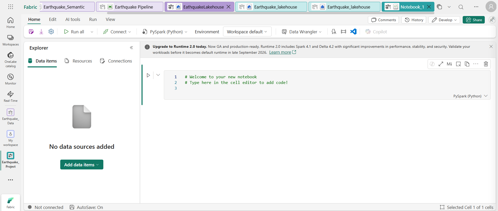

4. Copy the code from the corresponding file in the notebooks/ folder of this repo.

**Attach the Environment to Gold**
After creating the Gold notebook:
1. Open the Gold notebook
2. On the top toolbar click Home -> Environment
3. Select earthquake_env
4. Save the notebook.

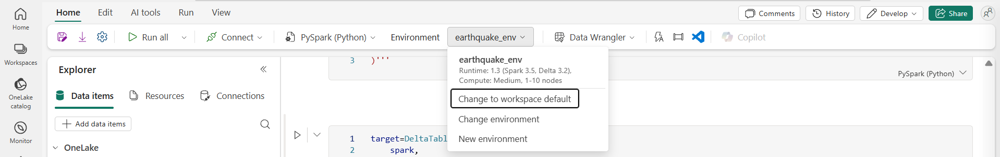

### Step 5 - Initialize the Delta Tables
Before running the pipepline for the first time, the silver and gold_events Delta tables must exist, the Silver and Gold Merge operations require the target tables to already be there.
1. Open silver and gold notebooks
2. Run the cells below:
   * Silver Notebook
     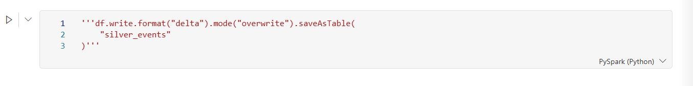
   * Gold Notebook
     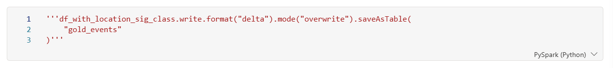
3. Confirm both tables appear in your Lakehouse Tables section.

**IMPORTANT** Before the initial pipeline run, execute the commented table-creation cells in both the Silver and Gold notebooks once to create the silver_events and gold_events Delta tables. Subsequent pipeline runs use Delta Lake MERGE for idempotent upserts.

### Step 6 - Build the Azure Data Factory Pipeline

1. Inside the workspace click New Item -> Pipeine
2. Name it and click Create

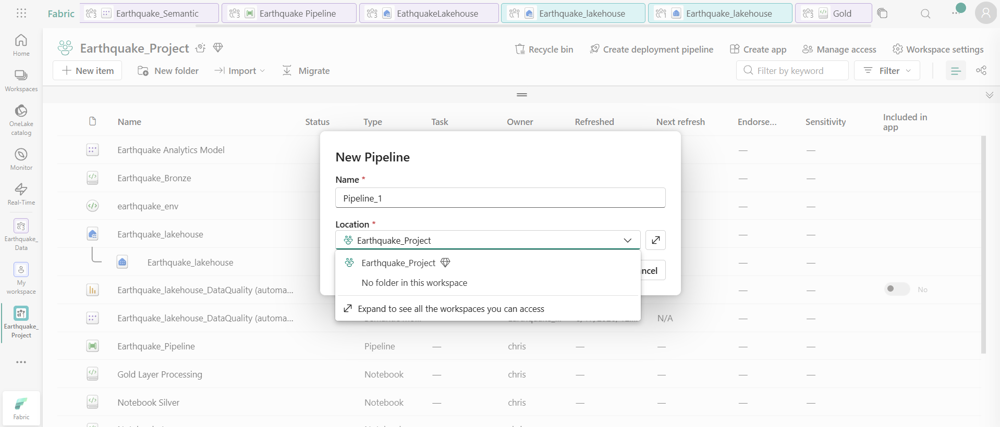

6.1  Add pipeline variable

Select "Activities" -> click  Set Variable -> create each variable as below:
1. Name: start_date | type: String | Value: {your start_date}
2. Name: Today | type: String | Value: @formatDateTime(utcNow(), 'yyyy-MM-dd')
3. Name: end_date | type: String | value: In my case "2026-09-01"
  * **NOTE**: The end_date variable must have an initial value because Fabric requires pipeline variables to be defined before execution.
4. Name: until1 | expression: @greaterOrEquals(variables('start_date'), variables('today'))
5. Name: Earthquake semantic model | connection: PowerBIDatasets user | Workspace: {select your workspace} | Semantic model: {select your semantic model} | Table(s): {Make sure you select the gold_events/gold table}
   NOTE: You need to do step 8 first.

6.2 Build Inside the Until Loop

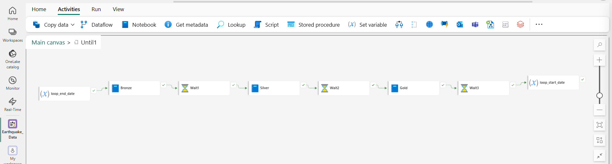

Double click the Until activity to open it, then add the following activities in order:
1. Set Variable - loop_end_date
   * Variable: loop_end_date
   * Variable type: Pipeline variable
   * Name: end_date
   * Value: @formatDateTime(
    addToTime(variables('start_date'), 1, 'Month'),
    'yyyy-MM-dd'
)

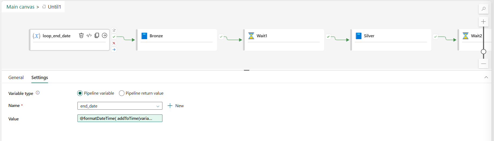

2. Notebook - Bronze
   * Click Notebook on the toolbar
   * Select the Bronze notebook
   * Under setting add:
       * Workspace: {select your workspace}
       * Notebook: Bronze
   * Base parameters
       1. start_date | String | @variables('start_date')
       2. end_date | String | @variables('end_date')

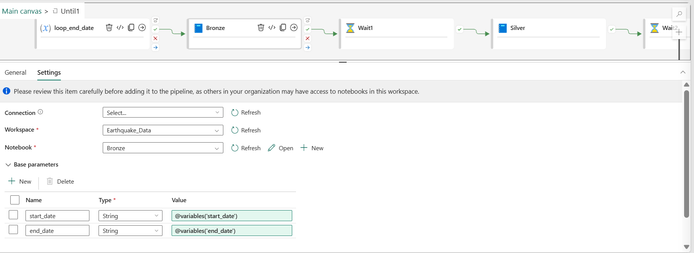

3. Notebook - Silver
   * Click Notebook on the toolbar
   * Select the Silver notebook
   * Under setting add:
       * Workspace: {select your workspace}
       * Notebook: Silver
   * Base parameters
       1. start_date | String | @variables('start_date')

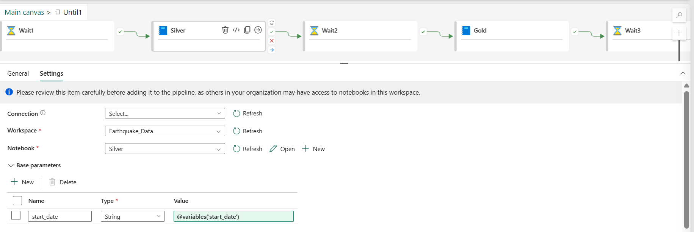

4. Notebook - Gold
   * Click Notebook on the toolbar
   * Select the Gold notebook
   * Under setting add:
       * Workspace: {select your workspace}
       * Notebook: Gold
   * Base parameters
       1. start_date | String | @variables('start_date')
       2. end_date | String | @variables('end_date')

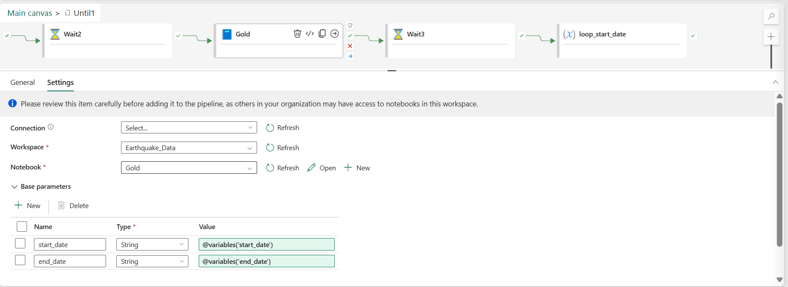

5. Set Variable - loop_start_date
   * Variable: loop_start_date
   * Variable type: Pipeline variable
   * Name: start_date
   * Value:@variables('end_date')

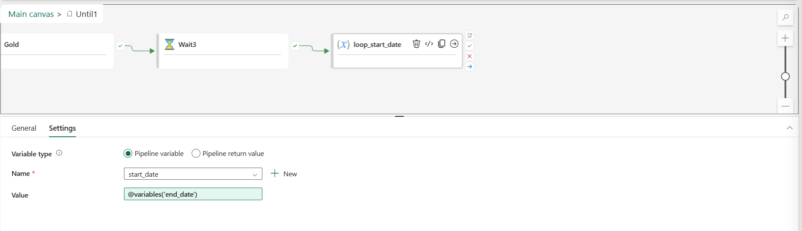

* **Wait Activities** Optional

The Wait activities are added between each notebook to give Spark enough time to release its Livy session before the next one starts. This was necessary on a Fabric trial account where Spark compute is limited. If you are on a paid Fabric capacity, you can reduce the duration or remove them entirely.

Connect all the activities in sequence inside the loop. As well as the main canvas as below:

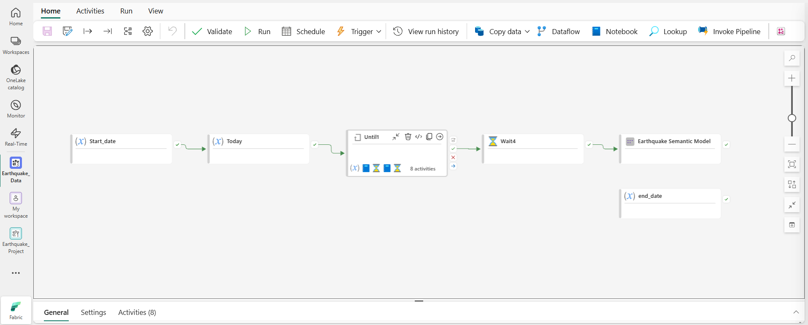

### Step 7 Set the schedule

In the pipeline click **Schedule** on the top toolbar selection
* Schedule the pipeline refresh daily or intraday.

### Step 8 - Create the Semantic Model

1. Go to your Lakehouse
2. On the top toolbar, click New Semantic Model
3. Name the semantic
4. Select the gold events table
5. Click Confirm

The semantic model will open automatically in Direct Lake mode.

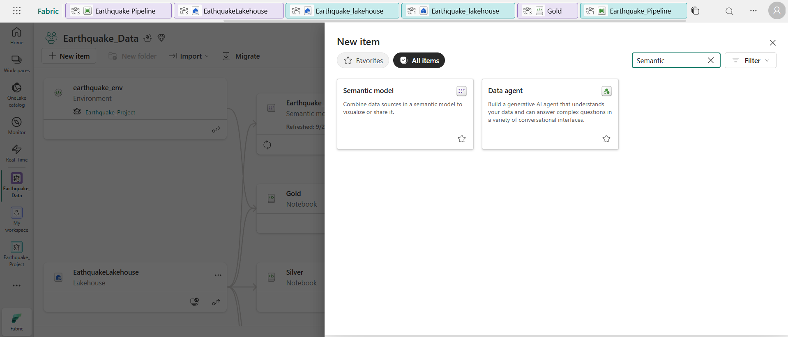

### Step 9 - Create the PBI Report

1. Open the Semantic model
2. Click File -> Create new report
3. Name the report e.g. Earthquake_model
4. Build your visual using the gold_events/gold table columns:
   * World Map
   * Donut Chart
   * Bar Chart
   * Line Chart
   * KPI Cards
   * Date slice on time - **set to numeric range (number of days)
5. Save and publish the report

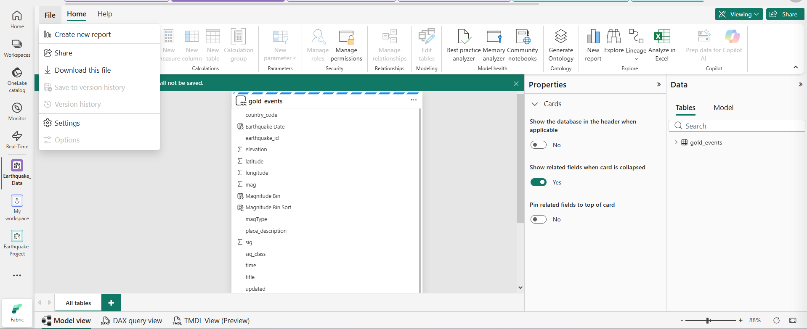

### Step 10 - Run the Pipeline

To run the pipeline manually for the first time:

1. Open your pipeline
2. Click Run
3. Enter parameters:
   * start_date: your start_date
   * end_date: your end_date
4. Click OK
5. Monitor progress under the activities tab.

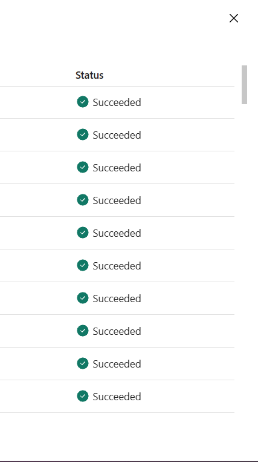

Once the run completes, open Earthquake_model your dashboard should be populated with data.

# You're All Set

Thats everything. If you followed every step correctly, the pipeline works perfectly and your're a genius. If it does'nt, welcome to data engineering.

A failed Livy session, a Merge that wont resolve, a stuck timestamp. These are not bugs, they are features of the learning experience.

Debug it, fix it, and you'll understand the whole thing twice as well as someone who got it right the first time. Which is probably no one.

Good luck. You'll need it. 
